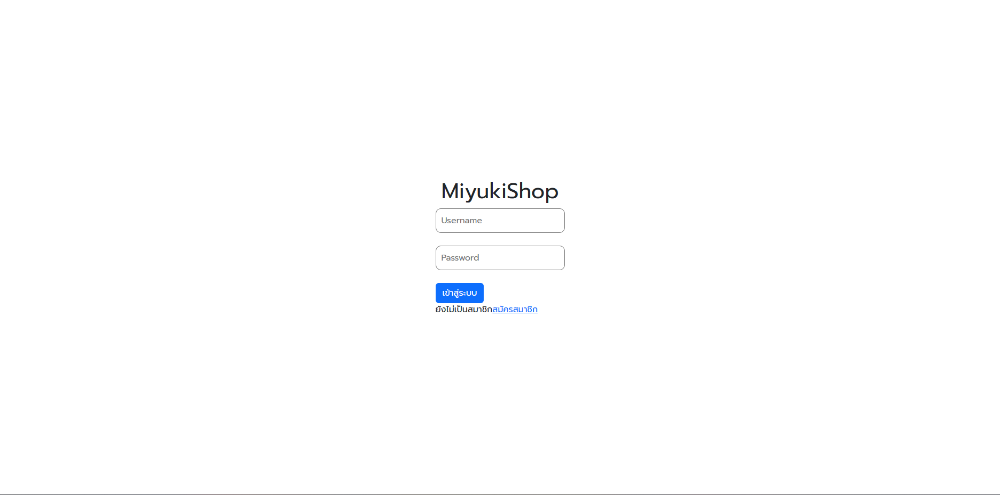
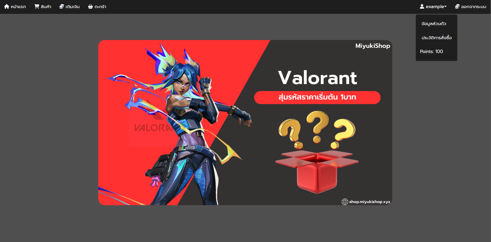
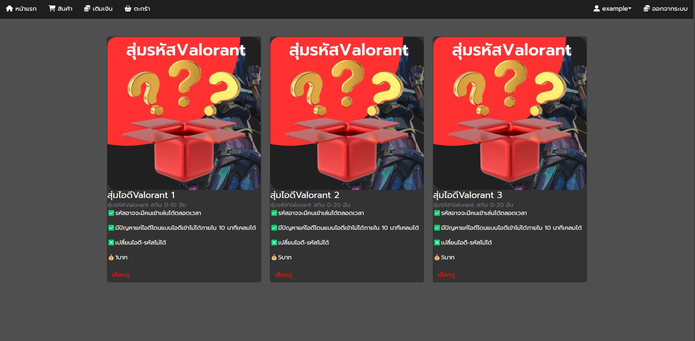
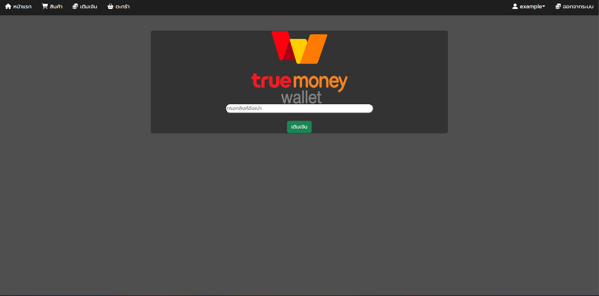
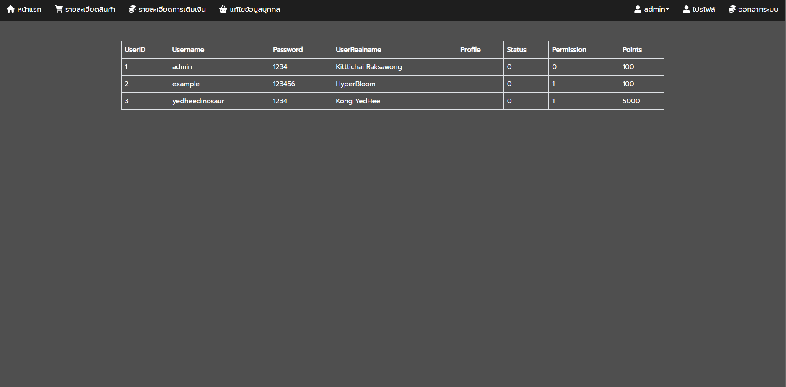

# MiyukiShop V.0.0.1

MiyukiShop V.0.0.1 

 1. Login only in this version.
 2. Wait to version 0.0.2 i'll make a add items to page.
 3. Can't by items in this version.
 4. Example for Bussines Website.

# How to Use
Downloads sql files and include to your database (mysql, nosql, heidisql, phpmyadmin) and start apache and mysql.

